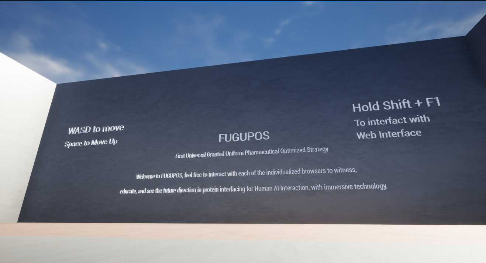
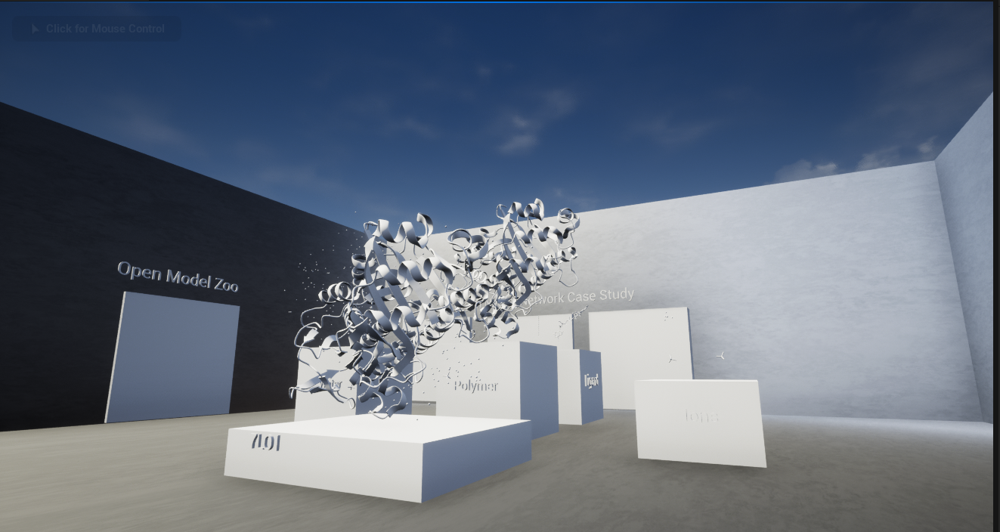

# FUGUPOS
This is a Web 3.0 Project for AI Molecular Modeling and 3D interfacing using Unreal Engine, and Unity for cross platform development &amp; Deployment

Demo can be accessed here
Requirements include Windows 10, Decent GPU, and Storage to run locally: https://www.kaggle.com/datasets/gchief117/fugupos-dataarchivedemo

Following work will showcase a video walkthrough demo users can see ()

And with futher documentation from Unreal Engine 5, a web-based arhvie with interactive framework will also be avialble.
